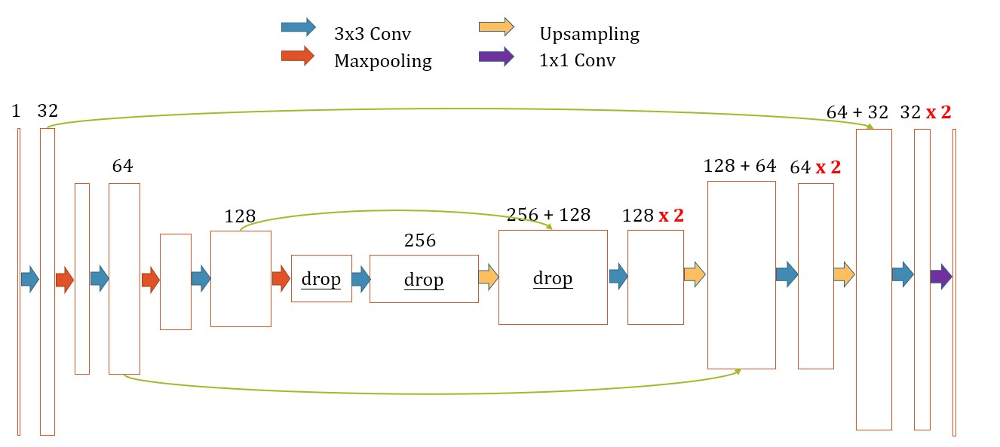

# U-Net for ISBI Challenge 2012 
Final test rand score: 0.979  

The architecture was inspired by [U-Net: Convolutional Networks for Biomedical Image Segmentation](http://lmb.informatik.uni-freiburg.de/people/ronneber/u-net/)
and implemented with Keras functional API.
---

## Overview

### Data
ISBI 2012 dataset: http://brainiac2.mit.edu/isbi_challenge/  
The dataset is in folder `data`.

### Model
 `src/models/structures.py`

### Training
training hyper-parameters:
- checkpoint_name: save_dir of tensorboard, set experiment name  
- batch_size: batch size, integer multiple of GPU numbers
- prop_trn: proportion of training data 20./30
- prop_val: proportion of validation data
- montage_trn_shape: width and height of training data combination (5, 4) 5*4=20
- montage_val_shape: width and height of validation data combination (5, 2) 5*2=10
- early_stop_patience: 30
- aug: whether to use deformation in data augmentation
- steps: steps of each epoch
- random_split: whether to random split the 30 images data

Loss functions `src/utils/model.py`:
- weighted cross entropy
- focal loss
- dice loss
- tversky loss
- combinations

---

## Usage

### train.ipynb
train on the isbi training data

### predict.ipynb
predict on validation or test data

### data-augmentation.ipynb
check the results after different data augmentation

---

## Acknowlegement

[alexklibisz work](https://github.com/alexklibisz/isbi-2012)
